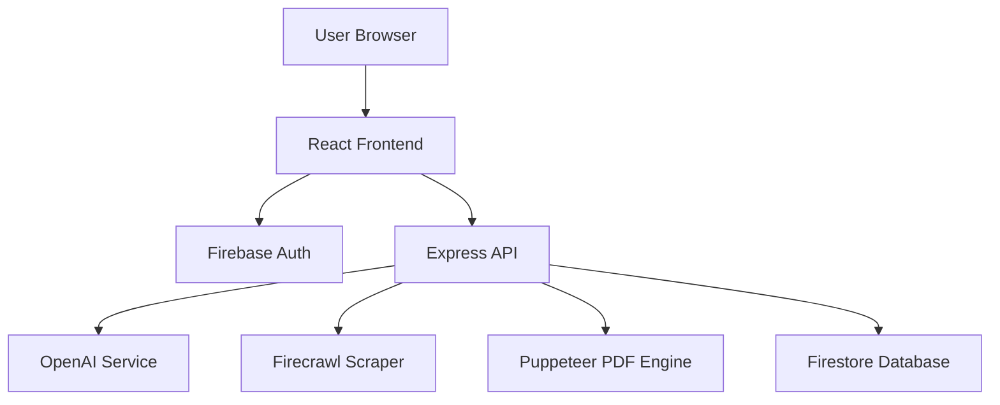

# System Architecture Overview

The **AI Resume Tailor** is built on a modern **React-Express-Firebase** stack, designed to be fast, scalable, and secure.

## Technology Stack
- **Frontend**: [[Frontend-Components|React]] with Vite, Tailwind CSS, and Lucide icons.
- **Backend**: [[Backend-Services|Node.js & Express]] (hosted on Railway).
- **Database/Auth**: [[External-Tools#Firebase|Firebase Admin SDK]].
- **AI Integration**: [[AI-Workflow|OpenAI GPT-4o-mini]] and [[External-Tools#Firecrawl|Firecrawl]] for web scraping.
- **PDF Engine**: [[Export-Workflow|Puppeteer]] running in a headless browser.

## Core Component Diagram

## System Workflow
1. User logs in via [[External-Tools#Firebase|Firebase Auth]].
2. User provides career data via [[AI-Workflow#Career-Wizard|Career Wizard]] or [[Frontend-Components#Resume-Builder|Resume Builder]].
3. AI generates/optimizes content through [[AI-Workflow|OpenAI]].
4. Finalized resume is sent to [[Export-Workflow|Puppeteer]] for high-fidelity PDF rendering.
